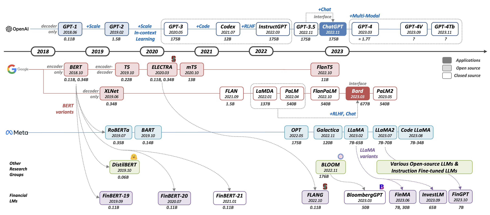
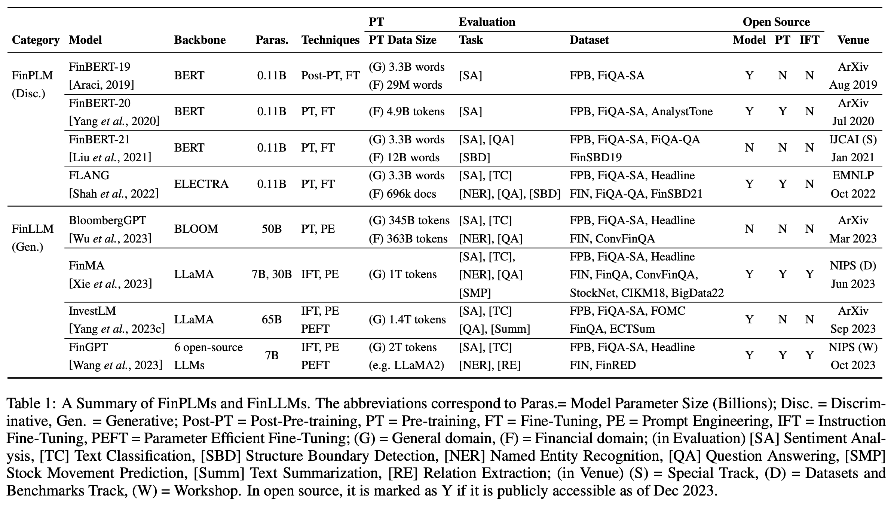
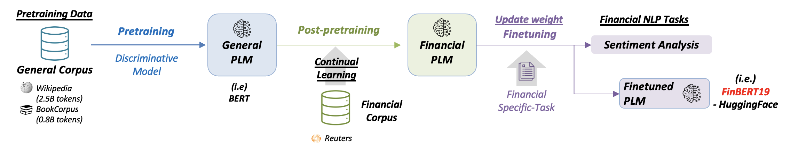
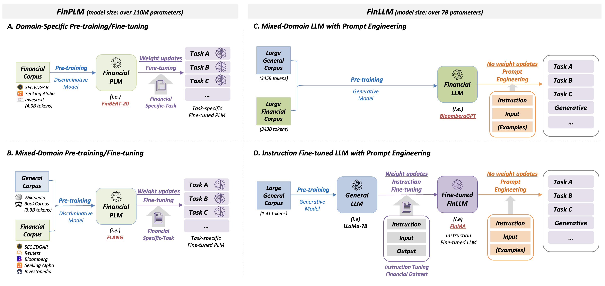
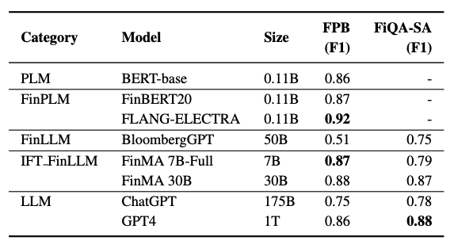
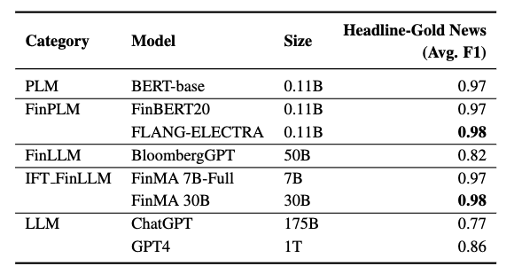
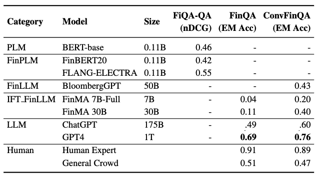
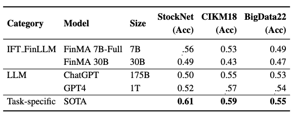
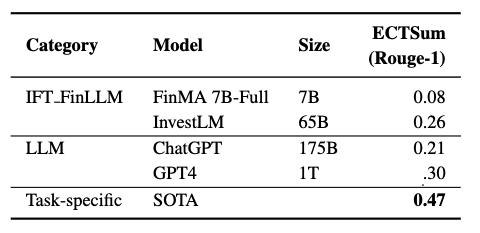

<h1 align="center">Large Language Models in Finance (FinLLMs)</h1>

<p align="center">
		     
</p>

A curated list of resources of LLMs in Finance (FinLLMs) including their history, techniques, evaluation, and opportunities and challenges. It's based on our survey paper: [A Survey of Large Language Models in Finance (FinLLMs)](https://arxiv.org/abs/2402.02315) (preprint), accepted at [Neural Computing and Applications 2025](https://link.springer.com/article/10.1007/s00521-024-10495-6). This survey will be actively updated, including further evaluation of advanced Financial NLP tasks, a collection of financial datasets, and sharing FinLLM use-cases. Please stay tuned!🔥


## Table of Contents
- [Evolution](#evolution) : from General LMs to Financial LMs
    - General-domain LMs 
    - Financial-domain LMs
- [Techniques](#techniques) : from FinPLMs to FinLLMs
    - Continual Pre-training : **FinBert-19**
    - Domain-Specific Pre-training from Scratch : **FinBERT-20**
    - Mixed-Domain Pre-training : **FinBERT-21, FLANG**
    - Mixed-Domain LLM with Prompt Engineering : **BloombergGPT**
    - Instruction Fine-tuned LLM with Prompt Engineering : **FinMA, InvestLM, FinGPT**
- [Benchmark Tasks and datasets](#benchmark-tasks-and-datasets) 
    - Sentiment Analysis
    - Text Classification
    - Named Entity Recognition 
    - Question Answering
    - Stock Movement Prediction
    - Text Summarization
- [Advanced Tasks and datasets](#advanced-tasks-and-datasets) 
    - Relation Extraction
    - Event Detection
    - Causality Detection
    - Numerical Reasoning
    - Structure Recognition
    - Multimodal Understanding
    - Machine Translation
    - Market Forecasting
- [Other Useful Resources](#other-useful-resources)
- [Citation](#citation)


## Evolution
Selected papers associated with the above figure.

### General-domain LMs 
- **GPT-1 :** Improving Language Understanding by Generative Pre-Training. 2018. [Paper](https://s3-us-west-2.amazonaws.com/openai-assets/research-covers/language-unsupervised/language_understanding_paper.pdf)
- **GPT-2 :** Language Models are Unsupervised Multitask Learners. 2019. [Paper](https://d4mucfpksywv.cloudfront.net/better-language-models/language_models_are_unsupervised_multitask_learners.pdf)
- **GPT-3 :** Language Models are Few-Shot Learners. NeurIPS 2020. [Paper](https://arxiv.org/abs/2005.14165)
- **GPT-4 :** GPT-4 Technical Report. 2023. [Paper](http://arxiv.org/abs/2303.08774v2)
- **BERT :** BERT: Pre-training of Deep Bidirectional Transformers for Language Understanding. NAACL 2018. [Paper](https://arxiv.org/abs/1810.04805)
- **T5 :** Exploring the Limits of Transfer Learning with a Unified Text-to-Text Transformer. JMLR 2019. [Paper](https://arxiv.org/abs/1910.10683)
- **ELECTRA :** ELECTRA: Pre-training Text Encoders as Discriminators Rather Than Generators. 2020. [Paper](https://arxiv.org/abs/2003.10555)
- **BLOOM :** BLOOM: A 176B-Parameter Open-Access Multilingual Language Model. 2022. [Paper](https://arxiv.org/abs/2211.05100)
- **LLaMA :** LLaMA: Open and Efficient Foundation Language Models. 2023. [Paper](https://arxiv.org/abs/2302.13971v1)
- **LLaMA2 :** Llama 2: Open foundation and fine-tuned chat models. 2023. [Paper](https://arxiv.org/abs/2307.09288)

### Financial-domain LMs 
- **FinBert-19 :** FinBERT: Financial Sentiment Analysis with Pre-trained Language Models. 2019. [Paper](https://arxiv.org/abs/1908.10063) | [Github](https://github.com/ProsusAI/finBERT) | [HuggingFace](https://huggingface.co/ProsusAI/finbert)
- **FinBert-20 :** FinBERT: A Pretrained Language Model for Financial Communications. 2020. [Paper](https://arxiv.org/abs/2006.08097) | [Github](https://github.com/yya518/FinBERT) | [HuggingFace](https://huggingface.co/yiyanghkust/finbert-pretrain)
- **FinBert-21 :** FinBERT: A Pre-trained Financial Language Representation Model for Financial Text Mining. *IJCAI special track 2021*. [Paper](https://www.ijcai.org/proceedings/2020/0622.pdf)
- **FLANG :** When FLUE Meets FLANG: Benchmarks and Large Pretrained Language Model for Financial Domain. *EMNLP main 2022*. [Paper](https://aclanthology.org/2022.emnlp-main.148/) | [Github](https://salt-nlp.github.io/FLANG/) | [HuggingFace](https://huggingface.co/SALT-NLP/FLANG-BERT)
- **BloombergGPT :** BloombergGPT: A Large Language Model for Finance, 2023, [Paper](https://arxiv.org/abs/2303.17564)
- **FinMA :** PIXIU: A Large Language Model, Instruction Data and Evaluation Benchmark for Finance. *NeurIPS datasets and benchmarks track 2023*. [Paper](https://arxiv.org/abs/2306.05443) | [Github](https://github.com/chancefocus/PIXIU) | [Leaderboard](https://huggingface.co/spaces/ChanceFocus/FLARE)
- **InvestLM :** InvestLM: A Large Language Model for Investment using Financial Domain Instruction Tuning. 2023. [Paper](https://arxiv.org/abs/2309.13064) | [Github](https://github.com/AbaciNLP/InvestLM)
- **FinGPT :** FinGPT: Instruction Tuning Benchmark for Open-Source Large Language Models in Financial Datasets. *NeurIPS Workshop 2023*. [Paper](https://arxiv.org/abs/2310.04793) | [Github](https://github.com/AI4Finance-Foundation/FinGPT)| [HuggingFace](https://huggingface.co/FinGPT)


<p align="center"></p>


## Techniques
- [FinPLMs] Continual Pre-training **: FinBert-19**
<p align="left"></p>

- [FinPLMs] Domain-Specific Pre-training from Scratch  **: FinBERT-20**
- [FinPLMs] Mixed-Domain Pre-training  **: FinBERT-21, FLANG**
- [FinLLMs] Mixed-Domain LLM with Prompt Engineering **: BloombergGPT**
- [FinLLMs] Instruction Fine-tuned LLM with Prompt Engineering **: FinMA, InvestLM, FinGPT**
<p align="left"></p>


## Benchmark Tasks and datasets  
<p align="left"></p>

Evaluation summary of representative models across 6 financial NLP tasks
- models : FinPLMs (FLANG), FinLLMs (BloombergGPT, FinMA), LLMs (ChatGPT, GPT-4), and task-specific state-of-the-art models (SOTA) models across 6 financial NLP tasks. 
- FinPLMs did not perform experiments on the more complex tasks such as Hybrid QA, SMP or Summ; hence, these data points are not included.
- Results are referenced from original or analysis research, and SOTA results from task-specific models.


| **Task** | **Dataset** | **Paper**        |  **Venue**  | **Link**  | **Data Link** |
| -------- | ------------|------------------| ----------- |-----------|---------------|
| Sentiment Analysis (SA) | **Financial PhraseBank (FPB)** | Good Debt or Bad Debt: Detecting Semantic Orientations in Economic Texts | JASIST 2014 |[Paper](https://arxiv.org/abs/1307.5336) | [HuggingFace](https://huggingface.co/datasets/financial_phrasebank)|
|  | **FiQA-SA** | WWW'18 Open Challenge: Financial Opinion Mining and Question Answering | WWW Workshop 2018 |[Paper](https://dl.acm.org/doi/fullHtml/10.1145/3184558.3192301) | [HuggingFace](https://huggingface.co/datasets/ChanceFocus/flare-fiqasa)|
|  | **SemEval-2017** | SemEval-2017 Task 5: Fine-Grained Sentiment Analysis on Financial Microblogs and News | SemEval 2017 |[Paper](https://aclanthology.org/S17-2089/) | [Bitbucket](https://bitbucket.org/ssix-project/semeval-2017-task-5-subtask-1/src/master/)|
| | **StockEmotions** | StockEmotions: Discover Investor Emotions for Financial Sentiment Analysis and Multivariate Time Series | AAAI Bridge 2023 |[Paper](https://arxiv.org/abs/2301.09279) | [Github](https://github.com/adlnlp/StockEmotions)|
| Text Classification (TC) | **Headline** | Impact of News on the Commodity Market: Dataset and Results | FICC 2021 |[Paper](https://arxiv.org/abs/2009.04202) | [Kaggle](https://www.kaggle.com/datasets/daittan/gold-commodity-news-and-dimensions)|
|  | **FedNLP** | FedNLP: An interpretable NLP System to Decode Federal Reserve Communications | SIGIR 2021 |[Paper](https://arxiv.org/abs/2106.06247) | [Github](https://github.com/usydnlp/FedNLP)|
|  | **FOMC** | Trillion Dollar Words: A New Financial Dataset, Task & Market Analysis | ACL 2023 |[Paper](https://aclanthology.org/2023.acl-long.368/) | [Github](https://github.com/gtfintechlab/fomc-hawkish-dovish)|
|  | **Baking77** | Efficient Intent Detection with Dual Sentence Encoders | NLP4ConvAI Workshop 2020 |[Paper](https://aclanthology.org/2020.nlp4convai-1.5/) | [HuggingFace](https://huggingface.co/datasets/PolyAI/banking77)|
| Named Entity Recognition (NER) | **FIN** | Domain Adaption of Named Entity Recognition to Support Credit Risk Assessment | ALTA Workshop 2015 |[Paper](https://aclanthology.org/U15-1010/) | [HuggingFace](https://huggingface.co/datasets/ChanceFocus/flare-ner)|
|   | **FiNER-139** | FiNER: Financial Numeric Entity Recognition for XBRL Tagging | ACL 2022 |[Paper](https://aclanthology.org/2022.acl-long.303/) | [Github](https://github.com/nlpaueb/finer)|
| Question Answering (QA) | **FiQA-QA** | WWW'18 Open Challenge: Financial Opinion Mining and Question Answering | WWW Workshop 2018 |[Paper](https://dl.acm.org/doi/fullHtml/10.1145/3184558.3192301) | [HuggingFace](https://huggingface.co/datasets/FinGPT/fingpt-fiqa_qa)|
|   | **FinQA** | FinQA: A Dataset of Numerical Reasoning over Financial Data | EMNLP 2021 |[Paper](https://arxiv.org/abs/2109.00122) | [Github](https://github.com/czyssrs/FinQA)|
|   | **ConvFinQA** | ConvFinQA: Exploring the Chain of Numerical Reasoning in Conversational Finance Question Answering | EMNLP 2022 |[Paper](https://arxiv.org/abs/2210.03849) | [Github](https://github.com/czyssrs/ConvFinQA)|
|   | **TAT-QA** | TAT-QA: A Question Answering Benchmark on a Hybrid of Tabular and Textual Content in Finance | ACL 2021 |[Paper](https://aclanthology.org/2021.acl-long.254/) | [Github](https://github.com/NExTplusplus/TAT-QA)|
|   | **PACIFIC** | PACIFIC: Towards Proactive Conversational Question Answering over Tabular and Textual Data in Finance | EMNLP 2022 |[Paper](https://aclanthology.org/2022.emnlp-main.469/) | [Github](https://github.com/dengyang17/PACIFIC)|
| Stock Movement Prediction (SMP) | **StockNet** | Stock Movement Prediction from Tweets and Historical Prices | ACL 2018 |[Paper](https://aclanthology.org/P18-1183/) | [Github](https://github.com/yumoxu/stocknet-dataset)|
|  | **CIKM18** | Hybrid Deep Sequential Modeling for Social Text-Driven Stock Prediction | CIKM 2018 |[Paper](https://weizhangltt.github.io/paper/cikm18-stock-preprint.pdf) | [Github](https://github.com/wuhuizhe/CHRNN)|
|  | **BigData22** | Accurate Stock Movement Prediction with Self-supervised Learning from Sparse Noisy Tweets | IEEE BigData 2022 |[Paper](https://jaeminyoo.github.io/resources/papers/SounYCJK22.pdf) | [Github](https://github.com/deeptrade-public/slot)|
| Text Summarization (Summ) | **ECTSum** | ECTSum: A New Benchmark Dataset For Bullet Point Summarization of Long Earnings Call Transcripts | EMNLP 2022 |[Paper](https://aclanthology.org/2022.emnlp-main.748/) | [Github](https://github.com/rajdeep345/ECTSum)|
|   | **MultiLing 2019** | MultiLing 2019: Financial Narrative Summarisation | RANLP 2019 |[Paper](https://aclanthology.org/W19-8902/) | [Website](http://multiling.iit.demokritos.gr/pages/view/1648/task-financial-narrative-summarization)|


### Evaluation details across 6 financial NLP tasks
- Sentiment Analysis (SA)
<p align="left"></p>
- Text Classification (TC)
<p align="left"></p>
- Named Entity Recognition (NER)
<p align="left"></p>
- Question Answering (QA)
<p align="left"></p>
- Stock Movement Prediction (SMP)
<p align="left"></p>
- Text Summarization (Summ)
<p align="left"></p>


## Advanced Tasks and datasets

| **Task** | **Dataset** | **Paper**        |  **Venue**  | **Link**  | **Data Link** |
| -------- | ------------|------------------| ----------- |-----------|---------------|
| Relation Extraction (RE) | **FinRED** | FinRED: A dataset for relation extraction in financial domain| FinWeb Workshop 2022 |[Paper](https://arxiv.org/abs/2306.03736) | [Github](https://github.com/soummyaah/FinRED/)|
| Event Detection (ED) | **EDT** |Trade the Event: Corporate Events Detection for News-Based Event-Driven Trading| ACL Findings 2021 |[Paper](https://aclanthology.org/2021.findings-acl.186/) | [Github](https://github.com/Zhihan1996/TradeTheEvent)|
| Causality Detection (CD) | **FinCausal20** |The Financial Document Causality Detection Shared Task (FinCausal 2020)| FNP-FNS Workshop 2020 |[Paper](https://aclanthology.org/2020.fnp-1.3/) | [Github](https://github.com/yseop/YseopLab/tree/develop/FNP_2020_FinCausal)|
| Numerical Reasoning (NR) | **FiNER-139, FinQA, ConvFinQA, TAT-QA, PACIFIC**  |refer to NER, QA tasks |   |  |  |
| Structure Recognition (SR) | **FinTabNet** |Global table extractor (gte): A framework for joint table identification and cell structure recognition using visual context| WACV 2021 |[Paper](https://arxiv.org/abs/2005.00589) | [Website](https://dataplatform.cloud.ibm.com/analytics/notebooks/v2/f57cf3f6-e972-48ff-ab7b-3771ba7b9683/view?access_token=317644327d84f5d75b4782f97499146c78d029651a7c7ace050f4a7656033c30)|
| Multimodal Understanding (MM) | **MAEC** | Maec: A multimodal aligned earnings conference call dataset for financial risk prediction| CIKM 2020 |[Paper](https://dl.acm.org/doi/10.1145/3340531.3412879) | [Github](https://github.com/Earnings-Call-Dataset/MAEC-A-Multimodal-Aligned-Earnings-Conference-Call-Dataset-for-Financial-Risk-Prediction)|
|  |**MONOPOLY** | Monopoly: Financial prediction from monetary policy conference videos using multimodal cues | MM 2022 |[Paper](https://dl.acm.org/doi/abs/10.1145/3503161.3548380) | [Github](https://github.com/monopoly-monitory-policy-calls/MONOPOLY)|
| Machine Translation (MT) | **MINDS-14** | Multilingual and Cross-Lingual Intent Detection from Spoken Data | EMNLP 2021|[Paper](https://aclanthology.org/2021.emnlp-main.591/) | [HuggingFace](https://huggingface.co/datasets/PolyAI/minds14)|
|   | **MultiFin** | MultiFin: A Dataset for Multilingual Financial NLP | EACL Findings 2023|[Paper](https://aclanthology.org/2023.findings-eacl.66/) | [Github](https://github.com/RasmusKaer/MultiFin)|
| Market Forecasting (MF) | **StockEmotions, EDT, MAEC, MONOPOLY** |refer to SA, ED, MM tasks |   |  |  |


## Other Useful Resources
We include several workshops and programs for financial NLP. The link directs to the most recent workshop website.
- [FNP] Financial Narrative Processing Workshop [5th](https://aclanthology.org/venues/fnp/)
- [FinNLP] Financial Technology and Natural Language Processing Workshop [5th](https://aclanthology.org/venues/finnlp/)
- [ECONLP] Economics and Natural Language Processing Workshop [4th](https://lt3.ugent.be/econlp/)
- [AiFinBridge] AAAI bridge - AI for Financial Services [2th](https://sites.google.com/view/aaai24-ai-fin)
- [MUFFIN] Multimodal AI for Financial Forecasting Workshop [2th](https://muffin-aaai23.github.io/)
- [KDF] Knowledge Discovery from Unstructured Data in Financial Services [4th](https://kdf-workshop.github.io/kdf23/)


## Citation
```bibtex

@article{lee2025large,
  title={Large Language Models in Finance (FinLLMs)},
  author={Lee, Jean and Stevens, Nicholas and Han, Soyeon Caren},
  journal={Neural Computing and Applications},
  pages={1--15},
  year={2025},
  publisher={Springer}
}
```

